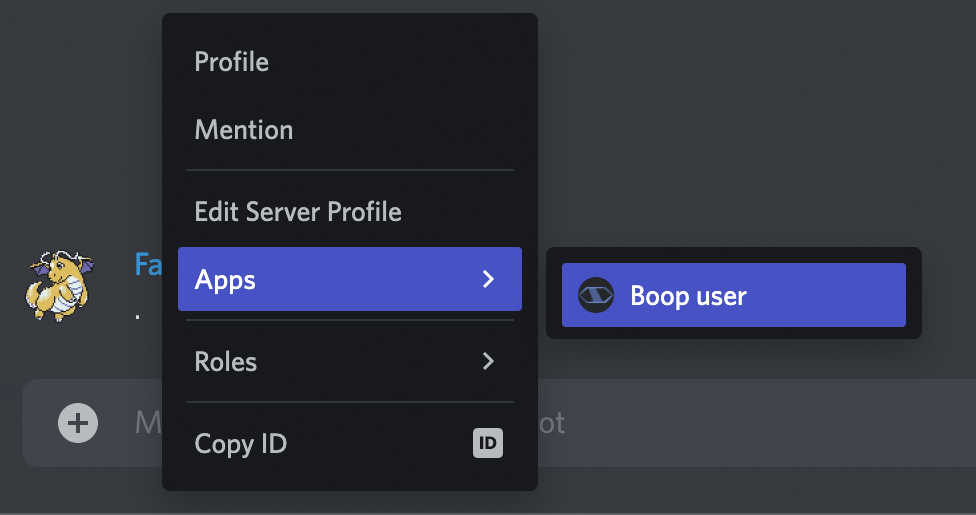

Context Menu Commands are another kind of application command. They show up, as the name implies, in the context menus
of either messages or users when you right click them.

| Message Context Menu                    | User Context Menu                    |
| --------------------------------------- | ------------------------------------ |
|  |  |

## How to register a Message Context Menu Command

:::warning

There's a lot of overlap with the previous [Registering Chat Input Commands][registering-chat-input-commands] section,
including important information that isn't repeated here, so please skim that first!

:::

Register a Message Context Menu Command by calling the [`registerContextMenuCommand`][rcmc] method on the registry with
the type specified in `.setType()`, this looks like:

```typescript ts2esm2cjs|{8,13-17}|{8,13-17}
import { Command } from '@sapphire/framework';
import { ApplicationCommandType } from 'discord-api-types/v9';

export class SlashCommand extends Command {
  public constructor(context: Command.Context, options: Command.Options) {
    super(context, {
      ...options,
      description: 'Delete message and ban author.' // In this case, this is not used
    });
  }

  public override registerApplicationCommands(registry: Command.Registry) {
    registry.registerContextMenuCommand((builder) =>
      builder //
        .setName(this.name)
        .setType(ApplicationCommandType.Message)
    );
  }

  public override contextMenuRun(interaction: Command.ContextMenuInteraction) {
    // ...
  }
}
```

It should be noted that unlike [Registering Chat Input Commands][registering-chat-input-commands], it's not possible for
Context Menu Commands to hold a description. This is why we recommend using the
[ContextMenuCommandBuilder][djs-context-menu-command-builder-docs] here for input verificiation instead of alternatives
such as writing the [`ApplicationCommandData`][djs-command-data-docs] JSON yourself.

:::caution

The [`registerContextMenuCommand`][rcmc] method, similar to the [`registerChatInputCommand`][rcic] method in the
previous section, takes in a second options parameter. Please see [Chat Input Command Registry Options][cicro], since
there are important details not repeated here.

:::

## How to register a User Context Menu Command

Registering a User Context Menu is done in the same way, with the only difference being a different type specified in
`.setType()`:

```typescript ts2esm2cjs|{16}|{16}
import { Command } from '@sapphire/framework';
import { ApplicationCommandType } from 'discord-api-types/v9';

export class SlashCommand extends Command {
  public constructor(context: Command.Context, options: Command.Options) {
    super(context, {
      ...options,
      description: 'Ban user.' // In this case
    });
  }

  public override registerApplicationCommands(registry: Command.Registry) {
    registry.registerContextMenuCommand((builder) =>
      builder //
        .setName(this.name)
        .setType(ApplicationCommandType.User)
    );
  }

  public override contextMenuRun(interaction: Command.ContextMenuInteraction) {
    // ...
  }
}
```

:::caution

Just like the Message Context Menu Command, the [`registerContextMenuCommand`][rcmc] method takes in a second options
parameter. Please see [Chat Input Command Registry Options][cicro], since there are important details not repeated here.

:::

## Implementing a Context Menu Command

Now that we've covered registering a Chat Input Command with Discord, the last step is to implement the `contextMenuRun`
method for the [`Command`][command] class so your bot can respond! The example here is the second User Context Menu
Command started above:

```typescript ts2esm2cjs|{21-37}|{21-37}
import { Command } from '@sapphire/framework';
import { ApplicationCommandType } from 'discord-api-types/v9';
import { Formatters, GuildMember } from 'discord.js';

export class SlashCommand extends Command {
  public constructor(context: Command.Context, options: Command.Options) {
    super(context, {
      ...options,
      description: 'Ban user.'
    });
  }

  public override registerApplicationCommands(registry: Command.Registry) {
    registry.registerContextMenuCommand((builder) =>
      builder //
        .setName(this.name)
        .setType(ApplicationCommandType.User)
    );
  }

  public override async contextMenuRun(interaction: Command.ContextMenuInteraction) {
    if (interaction.isUserContextMenu() && interaction.targetMember instanceof GuildMember) {
      await interaction.targetMember.ban({
        days: 8,
        reason: 'Banned for for breaking the rules.'
      });

      const userToGreetMention = Formatters.userMention(interaction.targetMember.id);

      return interaction.reply({
        content: `${userToGreetMention} has been successfully banned`,
        allowedMentions: {
          users: [interaction.targetMember.id]
        }
      });
    }
  }
}
```

:::info

Since `contextMenuRun` runs both kind of context commands, we recommend using either `isMessageContextMenu()` or
`isUserContextMenu()` to ensure the correct kind of context menu application command is executing your command.

:::

[cicro]: ./registering-chat-input-commands.mdx#chat-input-command-registry-options
[command]: ../../../Documentation/api-framework/classes/Command
[cmce]: ./message-context-menu-command.png
[djs-command-data-docs]: https://discord.js.org/#/docs/discord.js/v13/typedef/ApplicationCommandData
[djs-context-menu-command-builder-docs]: https://discord.js.org/#/docs/builders/0.16.0/class/ContextMenuCommandBuilder
[registering-chat-input-commands]: ./registering-chat-input-commands.mdx
[rcic]: ../../../Documentation/api-framework/classes/ApplicationCommandRegistry#registerchatinputcommand
[rcmc]: ../../../Documentation/api-framework/classes/ApplicationCommandRegistry#registercontextmenucommand
